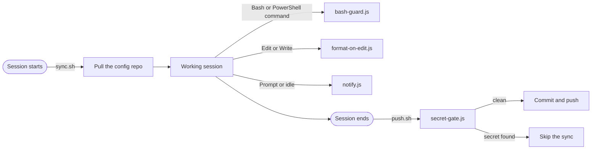

# claude-code-setup

My Claude Code configuration: rules, subagents, hooks and permissions for a Kotlin, Python and React stack.


This is the `~/.claude` directory I use every day on Windows and macOS, cleaned up so it can be shared. My work is mostly backend (Kotlin with Ktor, Python with FastAPI, MongoDB, Docker on a small VPS) with a React and Tailwind frontend on the side, and the setup is tuned for that.

I'm publishing it to be read and borrowed from, not installed as it is. The permissions, plugin choices and some paths are mine, and you will want your own. It is not affiliated with or endorsed by Anthropic.

## What's in it

| | |
|---|---|
| `CLAUDE.md` | Short global preferences: stack, tooling, how I want GitHub handled. |
| `rules/` | Nine rules. Four general ones are always loaded; five are per-stack (Python, Kotlin, MongoDB, Docker, frontend) and load only when a matching file is touched. |
| `agents/` | Nine subagents: planner, architect, code and security reviewers, a test-first guide, and a few for builds, cleanup, E2E and docs. |
| `commands/` | Eleven slash commands, such as `/plan`, `/verify` and `/build-fix`. |
| `scripts/` | Node hooks that guard commands, scan for secrets, format edited files and keep the config synced. |
| `settings.json` | Permissions (deny, ask, allow), hook wiring, plugins and model settings. |

## How the hooks fit together



## Ideas worth borrowing

**Keep the always-loaded part small.** `CLAUDE.md` and the four general rules come to about 2k tokens. Anything stack-specific lives in a rule with a `paths:` list in its frontmatter, so the Python rules cost nothing while I'm working on a Kotlin service.

**Write hooks in Node, without a shell.** The same scripts run on Windows and macOS. `bash-guard.js` blocks the usual disasters (force pushes, recursive deletes of root-like paths, `curl | sh`, dropping a database) and scans the staged changes for secrets before every `git commit`. It reports file, line and pattern, never the value. [How it works](docs/bash-guard.md).

**Make auto-sync fail closed.** A session-end hook commits and pushes the config repo. Because that commit would bypass the guard above, `secret-gate.js` runs the same scanner first. If it finds something, or breaks, the sync is skipped and nothing leaves the machine.

**Order permissions as deny, ask, allow.** Destructive and outward-facing commands ask first, routine safe ones run without a prompt, and secrets are off limits. Rules exist for both the Bash and PowerShell tools. Pattern matching on command text is not a security boundary, which is why the hook above exists as a second layer.

**Pick the model per job.** Opus for planning and architecture, Haiku for documentation, Sonnet for everything else, using aliases instead of pinned model IDs so the setup does not go stale.

## See it work

This is the real output of `bash-guard.js`, not a mock-up. Each command is sent to the hook as Claude Code would send it, and the last case commits a file that contains a fake token:

```
$ git push --force origin main
Blocked by bash-guard: force push.
Force pushes rewrite shared history. Ask the user to run it themselves.
[exit 2]

$ rm -rf ~
Blocked by bash-guard: recursive delete of a root-like path.
Delete a specific subdirectory instead.
[exit 2]

$ git commit -m "add config"
Blocked by bash-guard: possible secrets in the changes to be committed (values are not shown):
  - config.py:1  GitHub token
Remove them, load them from environment variables (Phase/.env), and rotate any secret that was ever pushed.
For an intentional test fixture, add the comment "secret-scan:allow" on that line.
[exit 2]

$ git status
[exit 0]
```

The message goes back to Claude, so it usually reacts by choosing a safer command or asking me, instead of retrying the same one.

## Layout

```
.
├── CLAUDE.md          global preferences, always loaded
├── settings.json      permissions, hooks, plugins, model
├── rules/             general rules, plus per-stack rules scoped with paths:
├── agents/            subagents
├── commands/          slash commands
├── scripts/
│   ├── hooks/         bash-guard, secret-gate, format-on-edit, notify, sync, push
│   └── lib/           shared helpers and the secret scanner
├── docs/
│   ├── bash-guard.md  how the command guard and secret scan work
│   └── reference.md   every rule, agent, command and hook in detail
└── skills/            list of the skills I use (not included)
```

## Using it

Read before you copy. The rules and agents are the easiest parts to reuse; start there and cut whatever does not match your stack.

Try the guard before you register it. Run this in a normal terminal, not through Claude with the hook enabled, because the guard would block the command that contains the test string. It should print `2`:

```sh
node -e "
const { spawnSync } = require('child_process');
const command = 'git push --' + 'force';
const r = spawnSync('node', ['scripts/hooks/bash-guard.js'], { input: JSON.stringify({ tool_input: { command } }), encoding: 'utf8' });
console.log(r.status);"
```

`sync.sh` and `push.sh` are written for my own setup and will not work for you as they are. They hardcode my private config repository, the branch `master` and the directory `$HOME/.claude`. Change those variables or leave the two hooks out of `settings.json`. `push.sh` commits and pushes everything your `.gitignore` allows, so keep the whitelist and the secret gate in place if you use it.

The full details, including the permission lists, the hook behaviour and how I set up a new machine, are in [`docs/reference.md`](docs/reference.md).

## Credits and license

My own work here is released under the [MIT License](LICENSE). It comes with no warranty, so read any hook that runs commands or pushes to git before you enable it.

Parts of `agents/` and `commands/` started from [everything-claude-code](https://github.com/affaan-m/ECC) by Affaan Mustafa, which is also MIT licensed. Its notice is kept in [`THIRD_PARTY_NOTICES.md`](THIRD_PARTY_NOTICES.md). The skills I use belong to their authors and are not included; [`skills/README.md`](skills/README.md) lists them with their licenses.
