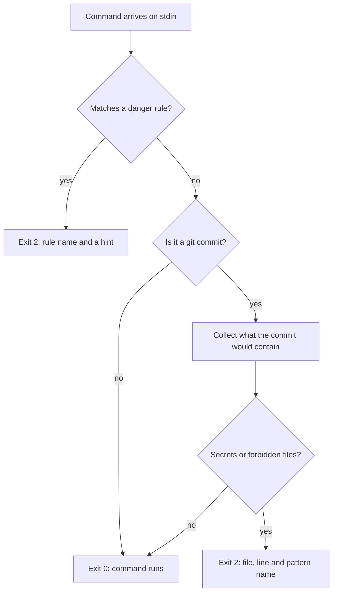

# bash-guard.js

`bash-guard.js` is a `PreToolUse` hook. Claude Code runs it before every Bash or PowerShell command, and passes the command to it as JSON on stdin. If the script exits with `0`, the command goes ahead. If it exits with `2`, the command is blocked and whatever the script wrote to stderr is sent back to Claude, so it can change course instead of just failing.

It does two jobs: it refuses a short list of commands that are hard to undo, and it scans for secrets before a `git commit`.

## Why it exists

My permission rules already deny and ask about a lot. The trouble is that those rules match the command text in its usual spelling. `git push --force` is covered, but `git push -f`, `git push origin +main` and the same thing buried in a longer one-liner are different strings. The guard looks at the whole command with patterns that cover those variants, so it works as a second layer behind the rules, not a replacement for them.

## How it decides



Any internal error also ends in exit `0`. A bug in the guard should never be able to lock a session.

## Job 1: dangerous commands

The rules live in [`scripts/lib/danger-patterns.js`](../scripts/lib/danger-patterns.js).

| Rule | Catches | Hint sent to Claude |
|---|---|---|
| Force push | `--force`, `--force-with-lease`, `--force-if-includes`, short flags containing `f`, `+refspec` | Ask the user to run it themselves |
| Recursive delete of a root-like path | `rm -r` or `-rf` aimed at `/`, `~`, `$HOME`, `.`, `..` or a drive root | Delete a specific subdirectory instead |
| Recursive `Remove-Item` | `-Recurse` on a drive root or the home folder, in PowerShell | Delete a specific subdirectory instead |
| Download piped into a shell | `curl`, `wget`, `iwr`, `irm` and friends piped into `sh`, `bash`, `zsh` or `iex` | Download the script, read it, then run it |
| Destructive Docker cleanup | `docker system prune` with `-a`, `--all` or `--volumes`, and `docker volume rm` or `prune` | This deletes volumes, so ask the user |
| Dropping a MongoDB database | `dropDatabase` | Ask the user to run it themselves |

The hint matters as much as the block. Claude reads it and usually picks a safer command or asks me, instead of retrying the same thing in a different spelling.

## Job 2: secrets before a commit

When the command contains `git ... commit`, the guard works out what is about to be committed:

- the staged diff, or
- for `git add ... && git commit` and `commit -a`, everything changed in the working tree against `HEAD`, plus untracked files that are small (under 256 KB) and not binary.

Only added lines are scanned, so old content and deleted lines are ignored. The scanner lives in [`scripts/lib/secret-scan.js`](../scripts/lib/secret-scan.js) and looks for:

- AWS access key IDs, GitHub tokens, Anthropic and OpenAI style keys, Slack tokens, Google API keys, Discord bot tokens and Phase tokens
- private key blocks
- database connection strings that carry a username and password (MongoDB, PostgreSQL, MySQL, Redis and AMQP URLs)
- hardcoded assignments such as `password = "..."` or `api_key: "..."`, skipping obvious placeholders (`example`, `changeme`, `<your-key>`, `${VAR}`, `process.env`)
- files that should never be committed: real `.env` files (but not `.env.example`), `*.pem`, `*.key`, `*.p12`, `*.pfx` and SSH private keys

A finding shows the file, the line and the pattern name. It never shows the value, so the report cannot leak the secret it found. For a deliberate test fixture, put the comment `secret-scan:allow` on that line.

## What it looks like

```
$ git commit -m "add config"
Blocked by bash-guard: possible secrets in the changes to be committed (values are not shown):
  - config.py:1  GitHub token
Remove them, load them from environment variables (Phase/.env), and rotate any secret that was ever pushed.
For an intentional test fixture, add the comment "secret-scan:allow" on that line.
[exit 2]
```

## Fail open here, fail closed there

The guard fails open: if it breaks, the command runs. That is the right trade for an interactive session, where the permission rules are still in front of it and I am watching.

[`secret-gate.js`](../scripts/hooks/secret-gate.js) uses the same scanner for the unattended auto-sync at session end and does the opposite: if it finds something or breaks, nothing is committed. Nobody is watching that commit, so the safe default is to do nothing.

## Limits

- **It matches text, not intent.** If a blocked pattern merely appears in a command, even inside an `echo` or a commit message, the guard blocks it. I hit this while writing the tests for this very repo.
- **It is not a sandbox.** Indirection such as variables, `sh -c "..."`, base64 or a script that runs the command for you gets past text matching. For real isolation use the operating system's sandbox.
- **The secret scan is best effort.** It matches known token shapes and obvious assignments. It does not measure entropy, so an unusual secret format can slip through, and it only sees the lines being added. A secret that is already in your history needs rotating, not scanning.
- **It only covers Bash and PowerShell calls.** That is where `git commit` happens, which is the case it was built for.

## Changing it

To add a rule, append an object to `RULES` in `danger-patterns.js` with a `name`, a `test` function and a `hint`. Then check it with a sample payload before you rely on it. Build the dangerous string at runtime in the test, otherwise your own guard will block the command that contains it:

```sh
node -e "
const { spawnSync } = require('child_process');
const command = 'git push --' + 'force';
const r = spawnSync('node', ['scripts/hooks/bash-guard.js'], { input: JSON.stringify({ tool_input: { command } }), encoding: 'utf8' });
console.log(r.status, r.stderr);"
```

A rule should print exit code `2` and a message that tells Claude what to do instead.
